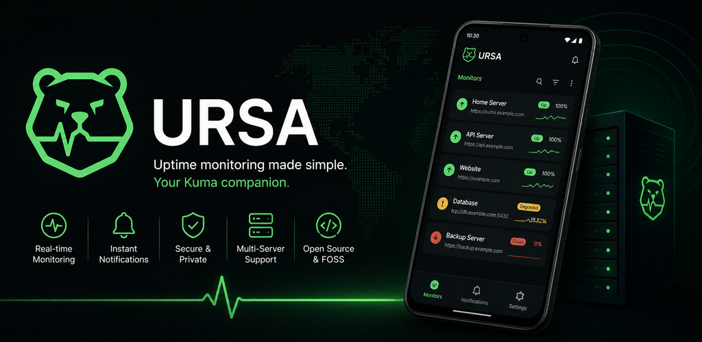
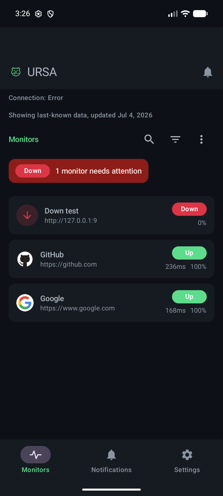
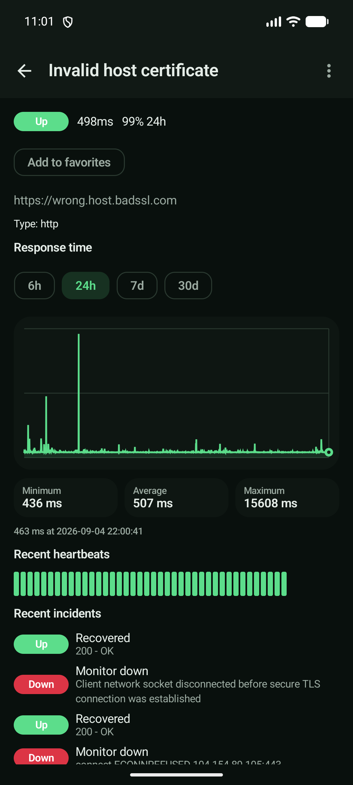
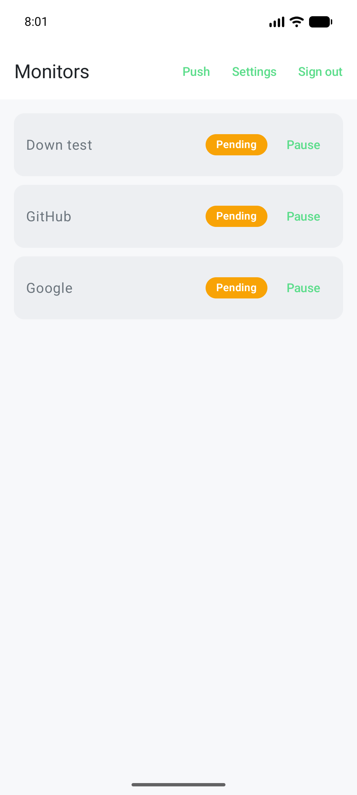

# URSA

**Your [Uptime Kuma](https://github.com/louislam/uptime-kuma) monitors, live in your
pocket.** URSA is a native Android app that keeps every self-hosted monitor a glance
away - real-time up/down status, heartbeat history, and push notifications that never
touch Google or a paid relay.

  
  
  

## 🐻 Why URSA?

You already run Uptime Kuma. It watches your homelab, your side project, your family's
Plex box - and it does it beautifully in the browser. But the moment you close the
laptop, you're back to refreshing a tab on your phone or wiring up yet another
notification bot.

Uptime Kuma has wanted a real Android app for years. The web dashboard is great on a
desktop but cramped on a phone, the existing apps are abandoned or read-only, and every
"just get alerts" path seems to end at Firebase or a third-party relay you have to trust.

URSA fixes that. It's the companion app your Kuma setup has been missing: fast, native,
and yours. Point it at your server, log in, and your monitors are just... there -
whenever you pull your phone out.

## ✨ What you get

- 📡 **Live status at a glance** - every monitor, up or down, updating in real time as
  Kuma pings them. No pull-to-refresh, no stale numbers.
- 📈 **Heartbeat history and uptime** - tap a monitor for its recent beats, response
  time, and uptime percentage, right where you'd expect it.
- 🔒 **TLS certificate details** - see which certs are healthy and which are about to
  expire, with local reminders before they do.
- 🔔 **Push notifications, your way** - get alerted the instant something goes down,
  routed through [UnifiedPush](https://unifiedpush.org) (e.g. ntfy). No Firebase, no
  Google Play Services, no relay server to run or pay for.
- 🖥️ **All your servers, one app** - connect multiple Uptime Kuma instances and switch
  between them.
- ⏯️ **Pause and resume** - silence a monitor during maintenance without opening a
  browser.
- 🔑 **Login that sticks** - username/password and two-factor (TOTP), with a session
  that heals itself when your connection drops.
- 🌐 **Public status pages** - check a shared status page without logging in at all.
- 🛡️ **Private by default** - credentials are encrypted on-device, only your session
  token is ever stored (never your password), and monitor data is hidden from
  screenshots and the app switcher.
- 📱 **Feels like Android** - a home-screen widget, a Quick Settings tile, app
  shortcuts, biometric app lock, an offline last-known view, and notification actions.
  Things the web dashboard simply can't do.
- 🎨 **Light and dark, Kuma's colors** - it uses Uptime Kuma's own palette and status
  conventions, so it feels like part of the family from the first launch.

## 📥 Get it

Grab the latest signed APK from the
[**Releases**](https://github.com/AstorisTheBrave/ursa-android/releases) page, install
it, open the app, and add your server's address (for example
`https://kuma.yourdomain.com`). That's it - log in and your monitors show up.

New to the app? The [Getting Started guide](https://github.com/AstorisTheBrave/ursa-android/wiki/Getting-Started)
walks you through your first connection, and
[Push Notifications](https://github.com/AstorisTheBrave/ursa-android/wiki/Push-Notifications)
covers getting alerts on your phone.

> An F-Droid listing is on the way.

## ✅ Works with your setup

| Your Kuma looks like... | URSA handles it |
|---|---|
| Uptime Kuma 2.4.x | ✔ verified against a live instance |
| Username / password login | ✔ |
| Two-factor (TOTP) | ✔ |
| Several servers | ✔ switch freely |
| Self-signed certificates | ✔ opt-in per connection |
| Plain-HTTP instances | ✔ |
| Behind nginx / Caddy / Traefik | ✔ |
| Behind a Cloudflare Tunnel | ✔ |

If your instance is reachable in a browser, URSA can talk to it - reverse proxy or
tunnel, it's all the same standard HTTPS + WebSocket underneath.

## ❤️ Support URSA

URSA is free and open source, built in spare time for the self-hosting community. If it
saves you a few browser refreshes, here's how you can help:

- ⭐ **Star the repo** - it genuinely helps others find the app.
- 🐛 **Report bugs and ideas** in [Issues](https://github.com/AstorisTheBrave/ursa-android/issues),
  or say hi in [Discussions](https://github.com/AstorisTheBrave/ursa-android/discussions).
- 💛 **Sponsor the project** using the **Sponsor** button at the top of the repo - even
  a coffee's worth keeps the batteries charged.

## 🤝 Contributing

Pull requests and issues are welcome. Start with [CONTRIBUTING.md](CONTRIBUTING.md), and
please be kind - we follow a [Code of Conduct](CODE_OF_CONDUCT.md). Found something
security-sensitive? See the [Security Policy](SECURITY.md).

## 🛠️ For developers

Curious how it works under the hood, or want to build it yourself? The technical deep
dive lives in the wiki:

- [Building and Testing](https://github.com/AstorisTheBrave/ursa-android/wiki/Building-and-Testing)
- [Architecture](https://github.com/AstorisTheBrave/ursa-android/wiki/Architecture)
- [Network and Protocol](https://github.com/AstorisTheBrave/ursa-android/wiki/Network-and-Protocol)
- [Push Internals](https://github.com/AstorisTheBrave/ursa-android/wiki/Push-Internals)
- [Security](https://github.com/AstorisTheBrave/ursa-android/wiki/Security)

In short: Kotlin + Jetpack Compose, Socket.IO for the live link, encrypted-at-rest
credentials, no third-party services. Releases are automated and every build ships
signed, with an SBOM and a provenance attestation attached.

## 📜 License

MIT - matching upstream Uptime Kuma. URSA is an independent client and is not affiliated
with the Uptime Kuma project.
