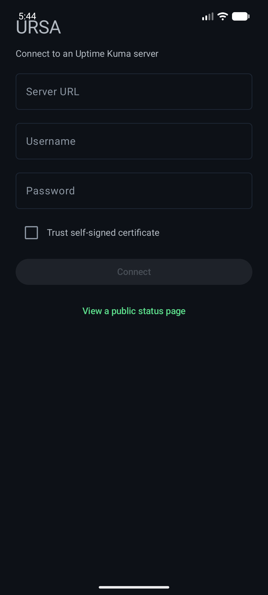

# URSA


[](https://github.com/AstorisTheBrave/ursa-android/actions/workflows/ci.yml)
[](LICENSE)


**Native Android client for Uptime Kuma - real-time monitoring, multi-server
support, and FOSS push notifications.**

Watch every self-hosted monitor from your phone: live up/down status, heartbeat
history, TLS certificate details, and pause/resume - across all your servers, with
push that needs no paid relay and no Google services.

- **Native Android** - Kotlin + Jetpack Compose, not another abandoned React Native
  wrapper.
- **No relay server** - push goes straight from your Kuma instance to your device.
- **No Firebase** - notifications ride [UnifiedPush](https://unifiedpush.org), so you
  choose the distributor (e.g. ntfy) and nothing routes through Google.

> Status: **M1 (core viewing)** and **M2 (encryption, resilient reconnect, TLS
> options)** are built. **M3 (push)** is next. On-device polish is ongoing.

## Why

Uptime Kuma is one of the largest self-hosted monitoring projects, yet after years
there's still no solid, actively maintained Android client - the existing options are
abandoned, broken, or read-only status-page viewers. URSA is built to be the one
homelab users can actually rely on: real-time, multi-server, and secure by default.

## Features

**Available now (M1 + M2)**
- Connect to one or more Uptime Kuma servers, switch between them
- Login with username/password and two-factor (TOTP); persistent, self-healing session
- Live monitor list - real-time status, ping, and uptime
- Monitor detail - heartbeat history and TLS certificate info
- Pause / resume a monitor
- Public status-page viewer (no login required)
- Credentials encrypted at rest (AES-256-GCM, key in the Android Keystore); only the
  session token is stored, never your password
- Optional trust for self-signed certificates, per connection
- Screenshots and recents previews blocked (`FLAG_SECURE`) so monitor data doesn't leak
- Light and dark mode, using Uptime Kuma's own colors and status conventions so it
  feels familiar (only the icons differ)
- Native extras: home-screen widget, Quick Settings tile, app shortcuts, biometric
  app lock, notification Pause/Resume actions, offline last-known view, and local
  TLS-expiry reminders

**Next (M3)**
- Push notifications via UnifiedPush - the app registers an endpoint you paste into a
  Kuma Webhook notification; no server to run, no Firebase
- F-Droid release

## Compatibility

| Capability | Supported |
|---|---|
| Uptime Kuma 2.4.x | ✔ (verified against a live instance) |
| Username / password login | ✔ |
| Two-factor authentication (TOTP) | ✔ |
| Multiple servers | ✔ |
| Self-signed certificates | ✔ (opt-in per connection) |
| Plain-HTTP instances | ✔ |
| Reverse proxies (nginx, Caddy, Traefik) | ✔ |
| Cloudflare Tunnel | ✔ |
| UnifiedPush notifications | 🚧 planned (M3) |

URSA talks to Kuma over standard HTTPS + WebSocket, so any transport your instance
sits behind - reverse proxy or tunnel - works the same way. The protocol is verified
against a live Uptime Kuma 2.4.0; a full on-device compatibility pass is in progress.

## Screenshots

Real screenshots from a device, running against a live Uptime Kuma instance. URSA
uses Kuma's own colors and status conventions, in light and dark mode.

<p>
  
  
  
  
</p>

## Tech

- Kotlin + Jetpack Compose (Material 3)
- Socket.IO for the live connection, Ktor for status-page REST
- DataStore + Tink + Android Keystore for encrypted-at-rest credentials
- AGP 9 / Gradle 9.4.1 · compileSdk 36 · minSdk 26 (Android 8.0+)

## Build

```bash
# Requires Android Studio (bundled JDK) + Android SDK
export JAVA_HOME="<path-to-jbr>"
./gradlew assembleDebug        # -> app/build/outputs/apk/debug/app-debug.apk
./gradlew :app:lintDebug
```

Point the app at a Uptime Kuma instance (e.g. `http://10.0.2.2:3001` from an
emulator). Local dev instance:

```bash
docker run -d -p 3001:3001 -v uptime-kuma:/app/data --name uptime-kuma louislam/uptime-kuma:2
```

## Roadmap

URSA follows **viewer -> actions -> push**. Beyond that, being native unlocks
things the Kuma web app cannot do: home-screen widgets, notification actions, a
Quick Settings tile, Wear OS, and more. See [docs/roadmap.mdx](docs/roadmap.mdx).

## Contributing

Issues and pull requests are welcome. See [CONTRIBUTING.md](CONTRIBUTING.md), the
[Code of Conduct](CODE_OF_CONDUCT.md), and the [Security Policy](SECURITY.md).

## License

MIT - matching upstream Uptime Kuma.
